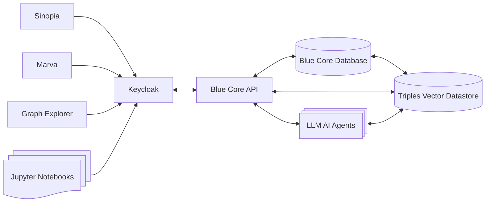

# Blue Core Terraform and Docker

## Configuration
The Keycloak Container requires a local `.env` with the following variables:

```bash
KEYCLOAK_ADMIN=admin
KEYCLOAK_ADMIN_PASSWORD=gracious-professed
KC_DB=postgres
KC_DB_URL_HOST=postgres
KC_DB_URL_PORT=5432
KC_DB_URL_DATABASE=keycloak
KC_DB_SCHEMA=public
KC_DB_USERNAME=airflow
KC_DB_PASSWORD=airflow
KC_PROXY_HEADERS=xforwarded
KC_PROXY=edge
KC_HTTP_ENABLED=true
KC_HTTP_RELATIVE_PATH=/keycloak/
KC_LOG_LEVEL=INFO
```
## Blue Core Technical Stack

